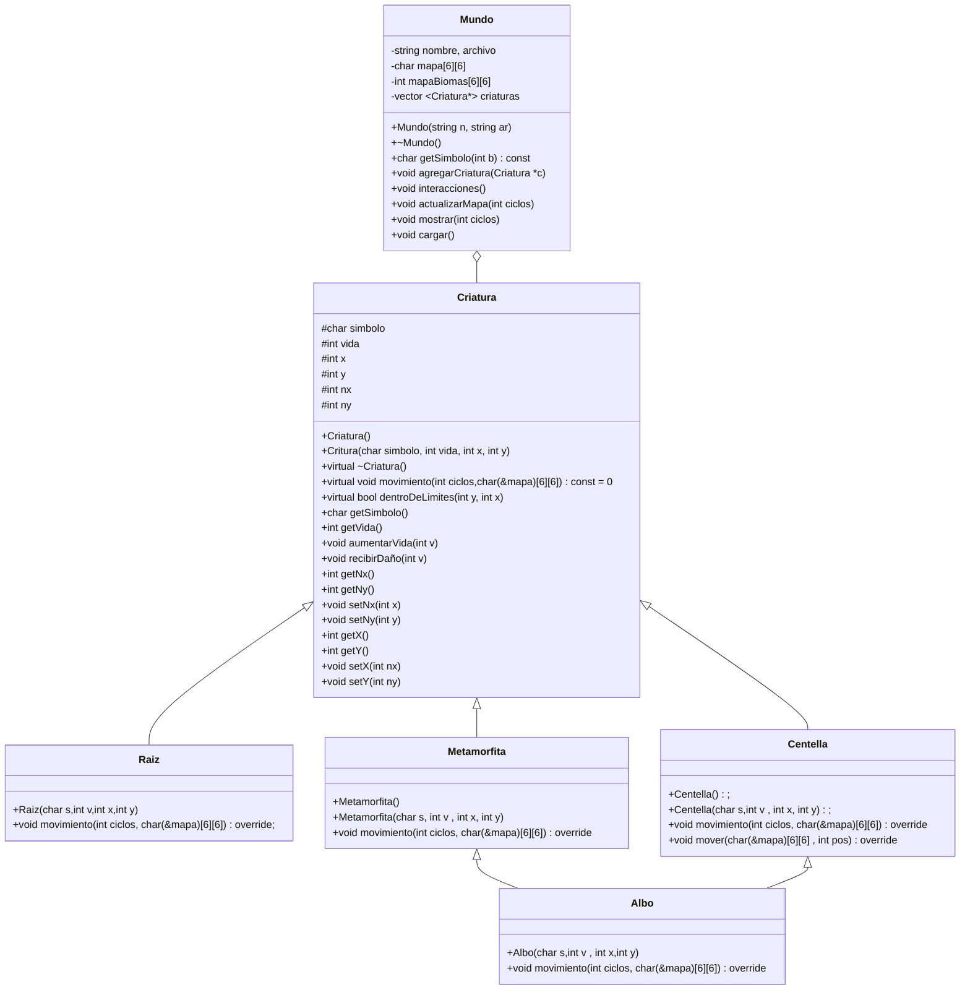

```mermaid 
classDiagram 
  class Mundo{
    -string nombre, archivo
    -char mapa[6][6]
    -int mapaBiomas[6][6]
    -vector ~Criatura*~ criaturas
    +Mundo(string n, string ar)
    +~Mundo()
    +char getSimbolo(int b) const
    +void agregarCriatura(Criatura *c)
    +void interacciones()
    +void actualizarMapa(int ciclos)
    +void mostrar(int ciclos)
    +void cargar()
  }
  class Criatura{
    #char simbolo
    #int vida
    #int x
    #int y
    #int nx
    #int ny
    +Criatura()
    +Critura(char simbolo, int vida, int x, int y)
    +virtual ~Criatura()
    +virtual void movimiento(int ciclos,char(&mapa)[6][6]) const = 0 
    +virtual bool dentroDeLimites(int y, int x)
    +char getSimbolo()
    +int getVida()
    +void aumentarVida(int v)
    +void recibirDaño(int v)
    +int getNx()
    +int getNy()
    +void setNx(int x)
    +void setNy(int y)
    +int getX()
    +int getY()
    +void setX(int nx)
    +void setY(int ny)
  
    }
  class Raiz{
    +Raiz(char s,int v,int x,int y)
    +void movimiento(int ciclos,  char (&mapa)[6][6]) override;
    }
  class Centella{
    +Centella();
    +Centella(char s,int v , int x, int y);
    +void movimiento(int ciclos, char (&mapa)[6][6]) override 
    +void mover(char (&mapa)[6][6] , int pos) override
  }
  class Albo{
    +Albo(char s,int v , int x,int y)
    +void movimiento(int ciclos, char (&mapa)[6][6]) override
  }
  class Metamorfita{
    +Metamorfita()
    +Metamorfita(char s, int v , int x, int y)
    +void movimiento(int ciclos, char (&mapa)[6][6]) override
  }
Mundo o-- Criatura
Criatura <|-- Raiz
Criatura <|-- Centella
Metamorfita <|-- Albo
Centella <|-- Albo
Criatura <|-- Metamorfita
```
